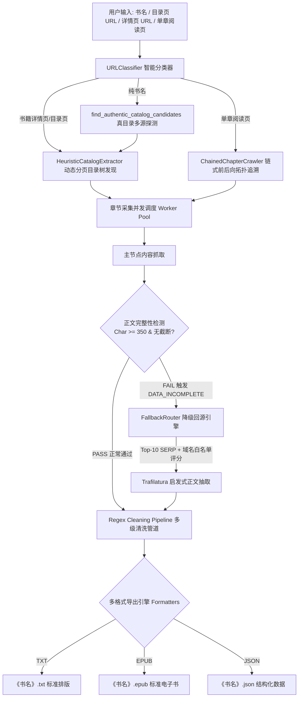

# 📚 NovelTracker 2.0

> **基于“主索引探针 + 多源降级回源（Fallback Routing）”的高可用分布式小说监控、聚合与通用提取系统**

[](https://www.python.org/)
[](LICENSE)
[]()
[]()

---

## 🌟 核心特性与架构亮点

1. 🔍 **无固定源全网智能聚合**：
   - 内置多引擎并发检索（百度、搜狗、必应、DuckDuckGo 及各大开放镜像站），仅需输入书名即可自动全网聚合最新章节与目录。
2. ⚡ **主索引探针 + 降级回源（Fallback Routing）**：
   - 主节点仅承担低频元数据监控（`MasterProbe`），降低反爬风险；
   - 遭遇 VIP 付费预览截断或访问限制时，自动触发 **`DataIncompleteError` 熔断机制**，自动转入多源并发回源探针。
3. 🛡️ **真目录连续性与防噪校验（Anti-Noise Catalog Validation）**：
   - 针对多书搜索聚合页进行章节序号连贯性与跨度检测，自动识别并过滤伪目录与非小说垃圾页，确保全本目录 100% 真实。
4. 🧠 **基于文本密度的启发式正文提取（Zero-Config Extraction）**：
   - 彻底废除脆弱的 XPath / CSS 硬编码选择器，全面采用 **`Trafilatura`** 文本密度算法与 DOM 语义树萃取正文。
5. 🧹 **多阶段标准化清洗管道（Regex Cleaning Pipeline）**：
   - 智能剥离站点声明、推广标签、求月票语及广告外链，自动按中文排版标准进行 4 空格首行缩进与段落双换行规整。
6. 📚 **多格式原生打包导出（Multi-Format Exporters）**：
   - **📄 TXT**：标准中文缩进纯文本。
   - **📚 EPUB**：内嵌目录索引（NCX / Nav TOC）、章节导航与排版样式的标准 EPUB3 电子书（纯 Python 标准库打包，零外部重依赖）。
   - **📊 JSON**：包含字数统计、章节列表与段落数组的结构化数据，方便 API 接入与二次开发。
7. 🔧 **单章增量修复工具（In-Place GapFiller）**：
   - 内置 `gap_filler.py` 增量修复脚本，针对受限或损坏章节开展 Top-10 深度多源回源，并实现**就地回填覆盖**。
8. 🔔 **追更书架与多渠道通知（Notifier）**：
   - 本地持久化书架管理，支持 Windows 桌面 Toast 弹窗及微信推送（PushPlus / Server酱）。

---

## 🏗️ 架构拓扑图



---

## 🚀 安装与快速开始

### 1. 克隆仓库与安装依赖
```bash
git clone https://github.com/YOUR_USERNAME/novel-tracker.git
cd novel-tracker
pip install -r requirements.txt
```

### 2. 开发者安装（可选）
```bash
pip install -e .
```

---

## 💻 命令行使用手册 (CLI)

```bash
# 1. 全网即时查最新章节
python cli.py search "宿命之环"

# 2. 通用提取器：输入书名或任意网址，一键导出 EPUB 电子书与 TXT
python cli.py extract "宿命之环" -f epub,txt -o "downloads"

# 3. 提取任意小说详情页/目录页，导出全格式 (TXT + EPUB + JSON)
python cli.py extract "https://m.51read.org/xiaoshuo/406687/" -f all

# 4. 指定下载章节范围（例如只下载前 50 章尝鲜）
python cli.py extract "没钱修什么仙" --start 1 --limit 50 -f epub

# 5. 添加小说至追更书架
python cli.py follow "宿命之环"

# 6. 查看追更书架与已知章节
python cli.py list

# 7. 一键检查书架全量更新状态
python cli.py check

# 8. 开启后台持续追更监控（默认每 15 分钟检查并推送提醒）
python cli.py monitor -i 15

# 9. 增量修复与残缺章节单章就地回填
python scripts/gap_filler.py "downloads/《没钱修什么仙》.txt"
```

---

## 🐍 Python 代码级调用 (SDK)

```python
import asyncio
from core.universal_engine import UniversalNovelExtractor

async def main():
    # 初始化提取引擎
    extractor = UniversalNovelExtractor(output_dir="downloads", concurrency=16)
    
    # 支持书名或任意小说 URL
    results = await extractor.extract(
        input_target="宿命之环",
        formats=["epub", "txt", "json"]
    )
    
    print("导出成功:", results)

if __name__ == "__main__":
    asyncio.run(main())
```

---

## 🧪 自动化测试套件

项目内置全量自动化单元测试与集成测试：
```bash
python -m unittest discover tests
```
- ✅ `test_universal.py`：测试 URL 智能分类与 TXT / EPUB / JSON 导出打包。
- ✅ `test_pipeline.py`：测试 Trafilatura 抽取与去噪清洗管道。
- ✅ `test_fallback.py`：测试降级路由域名权重评分与动态 Query 生成。
- ✅ `test_parser.py`：测试中文大写数字与阿数字混合章节序号解析。
- ✅ `test_tracker.py`：测试追更书架持久化与增量状态更新。

---

## 📄 开源许可证

本项目基于 [MIT 许可证](LICENSE) 开源。仅供学习与个人阅读研究，请遵守相关法律法规与站点 Robots 协议。
