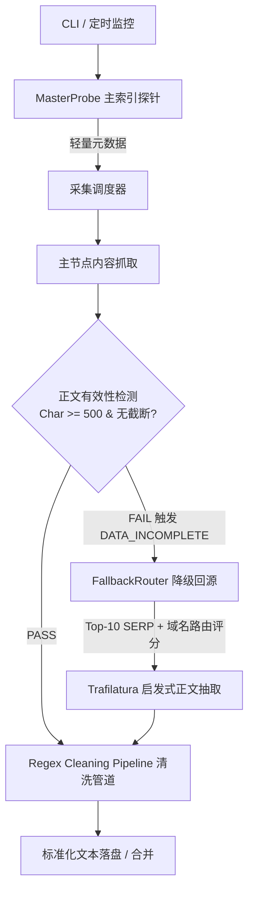

# 📚 NovelTracker

> **基于“主索引探针 + 多源降级回源（Fallback Routing）”的分布式小说更新监控与全文采集系统**

[](https://www.python.org/)
[](LICENSE)
[]()

---

## ✨ 核心特性

- 🔍 **无固定源全网检索**：内置多引擎聚合（百度、搜狗、Bing、DuckDuckGo 等），只需输入小说名自动全网检索。
- ⚡ **主探针 + 降级回源架构**：主节点仅作元数据监控，遭遇 VIP 预览截断或访问限制时自动触发 `DATA_INCOMPLETE` 熔断，切换至多源路由并发探针。
- 🧠 **启发式正文提取**：废除脆弱的硬编码选择器，全面采用 `Trafilatura` 文本密度算法与 DOM 语义解析提取正文。
- 🧹 **多阶段清洗管道**：自动过滤站点声明、推广标签、求月票语，按中文段落标准 4 空格自动缩进。
- 📖 **追更书架与监控**：支持本地持久化记录追更书架，支持控制台高亮卡片、Windows 桌面通知及微信推送（PushPlus / Server酱）。
- 🔧 **单章增量修复**：配备 `gap_filler.py` 增量修复工具，针对受限章节开展 Top-10 深度回源与就地回填。

---

## 🏗️ 架构拓扑



---

## 🛠️ 安装与快速开始

### 1. 克隆仓库与安装依赖
```bash
git clone https://github.com/YOUR_USERNAME/novel-tracker.git
cd novel-tracker
pip install -r requirements.txt
```

### 2. 配置文件（可选）
如需启用微信推送，将 `config.example.json` 复制为 `config.json` 并填入 Token：
```bash
cp config.example.json config.json
```

---

## 🚀 常用命令行 (CLI)

```bash
# 1. 全网即时查最新章节
python cli.py search "宿命之环"

# 2. 加入追更书架
python cli.py follow "宿命之环"

# 3. 查看当前追更书架
python cli.py list

# 4. 一键检查书架小说全量更新
python cli.py check

# 5. 全文多协程并发下载与合并
python cli.py download "没钱修什么仙" -u "https://m.51read.org/zhangjiemulu/406687" -o "downloads" -c 16

# 6. 启动后台定时监控模式（默认每 15 分钟检测一次并推送）
python cli.py monitor -i 15

# 7. 增量修复与残缺章节单章回填
python scripts/gap_filler.py "downloads/《没钱修什么仙》.txt"
```

---

## 🧪 自动化测试

项目内置完整的单元测试与集成测试套件：
```bash
python -m unittest discover tests
```

---

## 📄 开源许可证

本项目基于 [MIT 许可证](LICENSE) 开源。仅供学习与个人阅读研究，请遵守相关法律法规与站点 Robots 协议。
