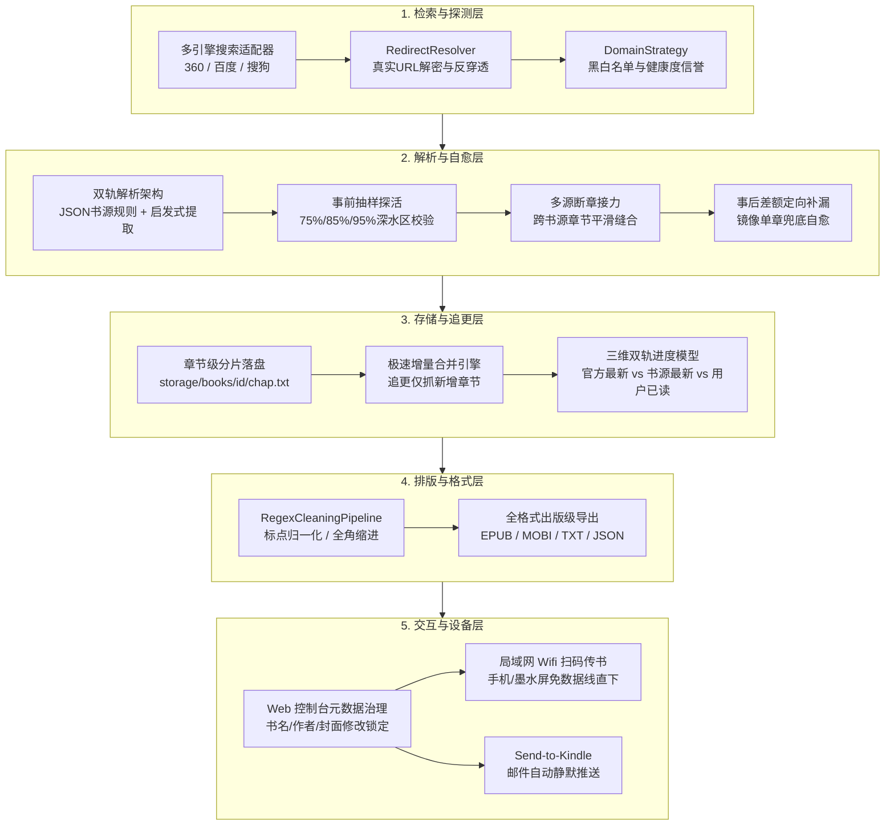

# 🗺️ Novel-Tracker 2.0 全景架构演进与全阶段技术路线规划 (Master Roadmap)

> 本文档汇聚了自愈机制实测复盘，以及深度借鉴 **owllook**、**so-novel**、**KindleHelper**、**timotaoshu**、**BookReader** 等 5 大优秀开源项目设计思想后的全景演进路线图。

---

## 🏗️ 全景架构演进蓝图 (Architecture Blueprint)



---

## 🧩 5 大核心维度演进方案矩阵

### 一、 检索与探测层（Search & Discovery）
| 改进项 | 核心痛点 | 借鉴来源 | 架构落地方案 |
| :--- | :--- | :---: | :--- |
| **真实 URL 解密还原** | 百度/360 加密短链穿透黑名单误选付费源 | `owllook` | 研发 `RedirectResolver`，在静态筛选前解密 `Location` 响应头，前置阻断官方付费域名 |
| **多搜索引擎矩阵** | 海外引擎在国内网络易断连 | `owllook` | 以 360 搜索、百度移动端为第一梯队，Bing/DuckDuckGo 为第二降级梯队 |

---

### 二、 解析与自愈层（Extraction & Self-Healing）
| 改进项 | 核心痛点 | 借鉴来源 | 架构落地方案 |
| :--- | :--- | :---: | :--- |
| **双轨解析架构** | 纯启发式 DOM 解析在混淆网页中不稳定 | `so-novel` / `owllook` | 引入 `sources/rules/*.json`，笔趣阁/69书吧等主流站点优先规则解析（100% 精度），未知站点启发式兜底 |
| **深水区事前探活** | 官方源前 80 章免费试读造成误判 | 实测复盘 | 探活采样点固定在 75%、85%、95% VIP 必然区间，正文字数 $\ge 500$ 字才算通过 |
| **多源断章接力缝合** | 中后段大面积缺章逐章盲搜开销大 | `so-novel` | 发生大面积锁死时，以断更点为界拉取次优全本书源的后半段区间，内存中按章节号无缝拼接 |

---

### 三、 存储与追更层（Storage & Incremental Updates）
| 改进项 | 核心痛点 | 借鉴来源 | 架构落地方案 |
| :--- | :--- | :---: | :--- |
| **章节级分片存储** | 每次追更重新全量下载 400+ 章浪费流量与算力 | `timotaoshu` | 建立 `storage/books/{hash}/{chap_idx}.txt`，已抓章节永久落盘 |
| **极速增量缝合导出** | 导出全本依赖单次抓取链路 | `timotaoshu` | 追更仅需下载新增的 2 章，毫秒级读取本地已有 400 章合并导出完整电子书 |
| **三维阅读进度追踪** | 无法记录用户读到了哪里 | `BookReader` | 记录【官方最新】、【书源最新】、【用户已读】三个刻度，精确显示未读与前瞻章节数 |

---

### 四、 排版与格式层（Formatting & Packaging）
| 改进项 | 核心痛点 | 借鉴来源 | 架构落地方案 |
| :--- | :--- | :---: | :--- |
| **文本标点归一化** | 段落首行无缩进、中英文标点混杂 | `so-novel` | 自动补全段落首行全角空格（`\u3000\u3000`），修复英文全半角符号与广告暗桩 |
| **出版级 EPUB 封装** | EPUB 无封面、排版简陋 | `so-novel` | 生成标准 TOC.ncx / Nav.xhtml 目录树、内嵌出版级 CSS 样式表与高清封面图 |
| **MOBI / AZW3 格式拓展** | Kindle 设备对原生 EPUB 兼容度有限 | `KindleHelper` | 集成 Calibre / Kindlegen 转换适配，支持直接导出 MOBI 格式 |

---

### 五、 交互与设备层（Interaction & Multi-Device Sync）
| 改进项 | 核心痛点 | 借鉴来源 | 架构落地方案 |
| :--- | :--- | :---: | :--- |
| **局域网 Wifi 扫码传书** | 手机/墨水屏导入电脑文件需连数据线 | `BookReader` | Web 端支持 `0.0.0.0` 局域网模式，生成下载二维码，手机/墨水屏扫码 1 秒直存 |
| **Send-to-Kindle 邮件直推** | 下载后需手动分发到设备 | `KindleHelper` | 支持配置 SMTP 邮箱，下载或追更完成后全自动将电子书静默发送至 Kindle 接收邮箱 |
| **Web 端元数据人工锁定** | 冷门小说作者或封面识别错误 | `timotaoshu` | 允许用户在 Web 书架弹窗上手动修改并锁定书名、作者、简介与自定义封面图 |

---

## 🗓️ 四阶段落地实施计划 (Milestone Schedule)

```text
Phase 1: 核心链路稳固与解析加固 (P0)
├── [Core] 实现 RedirectResolver，解密百度/360 短链，彻底封堵官方付费源绕过问题
└── [Core] 重构探活采样点（75%/85%/95% 深水区）与 DomainStrategy 闭环

Phase 2: 书源体系升级与增量追更 (P1)
├── [Sources] 建立 sources/rules/*.json 规则库，构建规则优先 + 启发式双轨解析
├── [Storage] 改造为章节分片落盘机制（storage/books/），实现秒级增量追更合并
└── [Engine] 实现多源断章平滑接力拼接（Source Stitching）

Phase 3: 设备生态互联与交互体验 (P2)
├── [Web] 仪表盘增加局域网二维码扫码下载功能（Wifi 扫码直传）
├── [Notifier] 增加 Send-to-Kindle 邮件自动静默推送服务
└── [Bookshelf] 升级为三维进度模型（官方 / 开放源 / 用户已读）

Phase 4: 出版级排版与数据治理 (P3)
├── [Cleaner] 文本标点归一化与全角缩进美化
├── [Formatter] 出版级 EPUB 样式表优化与 MOBI 格式支持
└── [Web] 支持书架卡片书籍元数据人工修偏与封面管理
```
